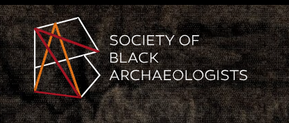

# 🏛️ Society of Black Archaeologists Technical Documentation

> *Documentation Platform for Advancing Archaeological Research and Technology*

??? warning

    This documentation serves as a prototype learning platform for students and professionals in archaeology. 
    It demonstrates one possible approach to organizing technical knowledge and resources. 
    This is a not-for-profit example, please keep in mind that there are multiple valid ways to structure and present this content.

{ width="300" }

## 📋 Overview

Welcome to the Society of Black Archaeologists Technical Documentation platform. This comprehensive resource is designed to support both students and professionals in the field of archaeology, with a particular focus on leveraging modern technology and open-source tools.

## 🎯 Target Audience

This documentation is structured to serve as education material for the archaeology community:

### 👨‍🎓 Students
- Introduction to open-source information and technology
- Technical tools and programming fundamentals
- Domain-specific applications
- Hosting and project completion

## 🚀 Getting Started

To begin exploring the documentation:

1. Select your role (Student) from the navigation menu
2. Browse through the relevant sections
3. Follow the step-by-step guides and tutorials
4. Access additional resources and references

## 📝 Contributing

We welcome contributions to this documentation platform. Please refer to our [contribution guidelines](contributing.md) for more information.

---

*Created by Malik P. Morgan | Last Updated: April 11, 2025*
